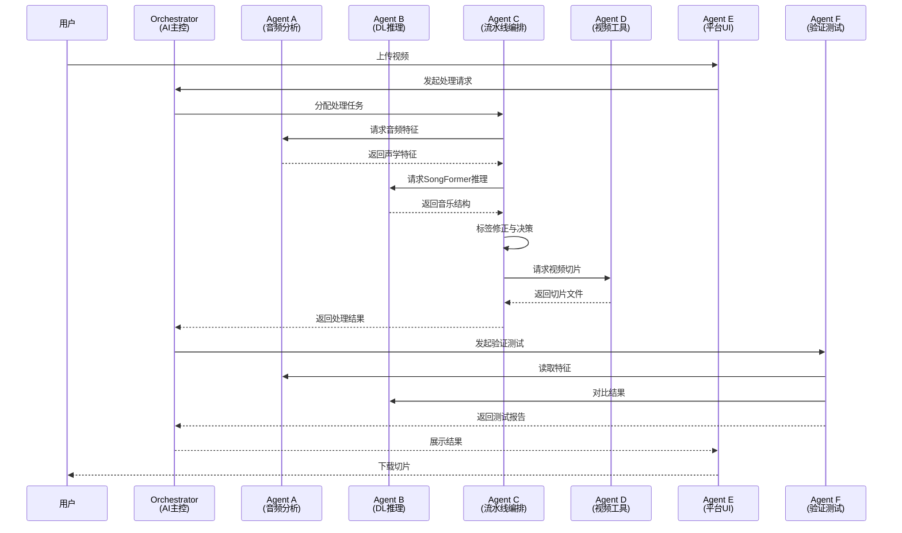
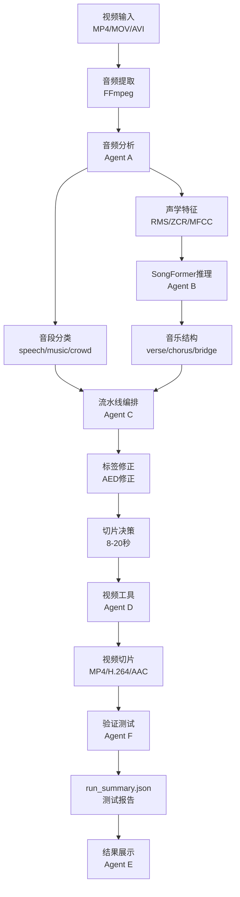

# v2.0 Agent 架构定义

**文档版本**: v1.0
**创建时间**: 2026-04-15
**最后更新**: 2026-04-18
**责任人**: AI
**变更日志**:
- 2026-04-15: 初始创建
- 2026-04-18: 添加统一文档头，链接GLOSSARY.md

---

## 0. 术语与定义

所有术语定义请参考：[GLOSSARY.md](./GLOSSARY.md)

---

## 架构总览

```
                    ┌─────────────────┐
                    │   Orchestrator  │ ← AI 主控(我)
                    │  (决策/拆分/审查)│
                    └──────┬──────────┘
                           │ 分配/协调
            ┌──────────────┼──────────────┬──────────────┐
            ▼              ▼              ▼              ▼
     ┌──────────┐  ┌──────────┐  ┌──────────┐  ┌──────────┐
     │    A     │  │    B     │  │    C     │  │    D     │
     │ 音频分析  │  │ DL推理   │  │ 流水线   │  │ 视频工具  │
     └──────────┘  └──────────┘  └──────────┘  └──────────┘
                                          │
            ┌──────────────┴──────────────┤
            ▼                             ▼
     ┌──────────┐                  ┌──────────┐
     │    E     │                  │    F     │
     │ 平台UI   │                  │ 验证测试  │
     └──────────┘                  └──────────┘
```

---

## 架构序列图



---

## 数据流程图



---

## 各 Agent 职责定义

### A — 音频分析 (Audio Analysis)
**负责模块**: `audio_analyzer.py` 及声学特征相关
**核心职责**:
- 音频预处理（归一化、降噪、增强）
- 声学特征提取（RMS、能量、频谱、MFCC 等）
- 能量指纹计算 / 音频指纹匹配
- 音段分类辅助（speech/music/crowd 的声学判断依据）

### B — 深度学习推理 (Deep Learning Inference)
**负责模块**: 模型加载、推理调用
**核心职责**:
- SongFormer 模型推理（结构分析：verse/chorus/bridge 等）
- Whisper 模型推理（ASR 字幕识别）
- FunASR 推理（中文 ASR 备选引擎）
- 模型管理（加载/卸载/显存调度）
- GPU 资源协调

### C — 流水线编排 (Pipeline Orchestration)
**负责模块**: `processor.py` 核心逻辑
**核心职责**:
- 整体处理流程编排（process_video 主流程）
- 歌曲识别决策（Shazam 投票、OCR 融合、回并判断）
- 切片标签确定与优化
- 各子模块结果的汇聚与冲突解决
- 错误处理与降级策略

### D — 视频处理工具 (Video Tools)
**负责模块**: `video_processor.py` / FFmpeg 封装
**核心职责**:
- 视频切片（精确时间切割）
- 音频提取与格式转换
- 字幕烧录（ASS/SRT → 视频）
- 批量文件操作
- FFmpeg 参数优化（GOP、关键帧对齐）

### E — 平台 UI (Platform UI)
**负责模块**: `app.py` Streamlit 应用
**核心职责**:
- 用户交互界面
- 参数配置面板
- 进度展示与状态反馈
- 文件上传/下载管理
- 结果预览

### F — 验证测试 (Validation & Testing)
**负责模块**: 测试脚本、基准报告
**核心职责**:
- 基准测试脚本开发与执行
- 新旧方案对比评估
- 回归测试
- 验收报告生成
- 度量指标定义与采集

## 协作规则

1. **C 是中枢** — 大部分跨模块协调通过 C 进行
2. **A 为 C 提供数据** — C 决策时需要的声学特征由 A 提供
3. **B 是重资源** — GPU 操作串行化，C 负责 B 的调用时序
4. **F 独立运行** — 验收测试不依赖 E（可命令行跑），但依赖 A+B+C+D 的输出
5. **D 是底层工具** — 被 C 和 F 调用，不主动发起流程

## 当前映射到 Sub-agent 实现

| 架构角色 | 实际执行者 | 说明 |
|---------|-----------|------|
| Orchestrator | AI 主控 | 我本人：决策、审查、分配 |
| A (音频分析) | code-explorer + 手写 | 特征计算代码通常手写，搜索用 agent |
| B (DL推理) | 不经手 agent | 模型推理是调用现有 API |
| C (流水线编排) | code-simplifier / 手写 | 核心逻辑改动需精细控制 |
| D (视频工具) | 一般不改，用现成 | FFmpegProcessor 已封装完善 |
| E (平台UI) | code-simplifier | UI 层改动 |
| F (验证测试) | code-simplifier + data plugin | 脚本编写 + 数据可视化 |

## 变更日志

| 日期 | 变更内容 | 操作人 |
|------|---------|--------|
| 2026-04-15 | 初始创建，从 v2.0 审批讨论中整理 | AI |
