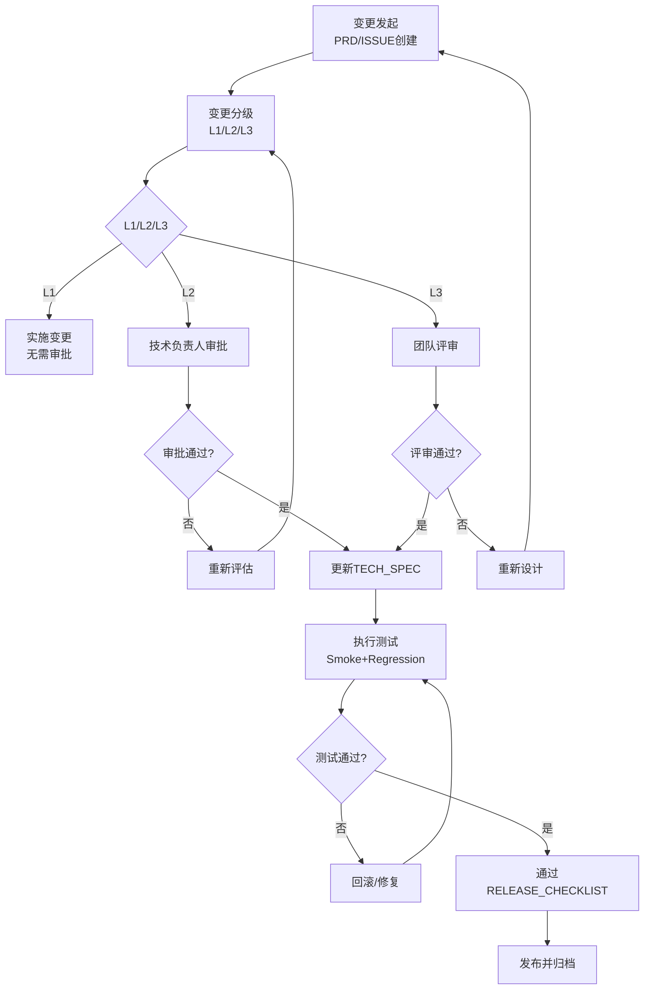

# CHANGE_POLICY（变更管理规范）

**文档版本**: v1.0
**创建时间**: 2026-04-15
**最后更新**: 2026-04-18
**责任人**: AI
**变更日志**:
- 2026-04-15: 初始创建
- 2026-04-18: 添加统一文档头，链接GLOSSARY.md

---

## 0. 术语与定义

所有术语定义请参考：[GLOSSARY.md](../GLOSSARY.md)

---

## 1. 目标
- 所有需求与技术变更都可追踪、可审计、可回滚。

## 2. 适用范围
- 功能变更、参数变更、依赖变更、流程变更、发布变更。

## 3. 输入与输出
- 输入：PRD 变化、技术方案变化、线上事件。
- 输出：变更记录、影响评估、发布/回滚决策。

---

## 4. 变更分级
- L1（低风险）：文档或注释变更，不影响行为。
- L2（中风险）：局部逻辑、参数调整，影响可控。
- L3（高风险）：主流程、依赖栈、模型路径、输出规范变更。

---

## 5. 变更流程
1. 提交变更申请（关联 PRD ID）
2. 更新 TECH_SPEC（影响面、回退方案）
3. 执行测试（至少 smoke + regression）
4. 通过 RELEASE_CHECKLIST
5. 发布并归档变更记录

---

## 6. 变更记录模板
- **变更 ID**：格式CHANGE-YYYY-XXX，如CHANGE-2026-001
- **级别**：L1/L2/L3
- **变更描述**：简短描述变更内容
- **影响模块**：影响哪些模块
- **配置变更**：是否有配置变更
- **测试结论**：PASS/FAIL
- **发布决策**：发布/不发布
- **回滚条件**：什么情况下需要回滚

---

## 7. 变更审批流程

### 7.1 L2审批流程
**审批人**：技术负责人
**审批标准**：
- TECH_SPEC是否完整
- 影响评估是否充分
- 回滚方案是否明确
- 测试计划是否合理

**审批步骤**：
1. 开发人员提交变更申请
2. 技术负责人评审TECH_SPEC和影响评估
3. 技术负责人给出审批结论（通过/不通过）
4. 不通过时，返回修改意见，开发人员修改后重新申请
5. 通过后，进入执行测试阶段

### 7.2 L3评审流程
**评审人**：团队评审（至少2人）
**评审内容**：
- 技术方案的可行性
- 架构设计的合理性
- 性能影响评估
- 风险和回滚方案
- 测试完整性

**评审步骤**：
1. 技术负责人组织团队评审会议
2. 开发人员演示和讲解方案
3. 团队成员提问和讨论
4. 记录评审意见和修改建议
5. 开发人员根据意见修改方案
6. 重新评审直到通过

---

## 8. 影响评估模板

| 字段 | 值 |
|-----|-----|
| 变更ID | CHANGE-YYYY-XXX |
| 变更级别 | L1/L2/L3 |
| 影响范围 | 哪些模块/功能受影响 |
| 风险等级 | 高/中/低 |
| 性能影响 | 处理速度/内存占用/显存占用 |
| 准确率影响 | 哪些标签的准确率可能变化 |
| 兼容性影响 | 是否向后兼容 |
| 测试要求 | 需要什么测试（Smoke/Regression/Performance） |
| 回滚预案 | 出问题怎么办 |
| 评估人 | 评估人姓名 |
| 评估时间 | YYYY-MM-DD |

---

## 9. 紧急变更（Hotfix）
- 可跳过部分流程，但必须在 24 小时内补齐文档与测试记录。
- Hotfix 必须包含明确回滚触发条件。

## 8. 验收标准
- 所有变更都有唯一 ID 与记录闭环。
- L3 变更必须具备回滚演练记录或明确预案。
