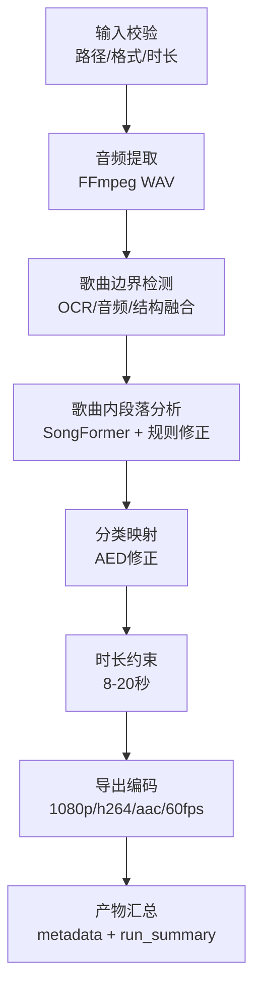
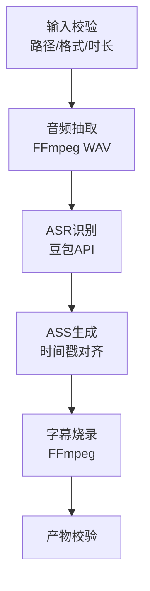
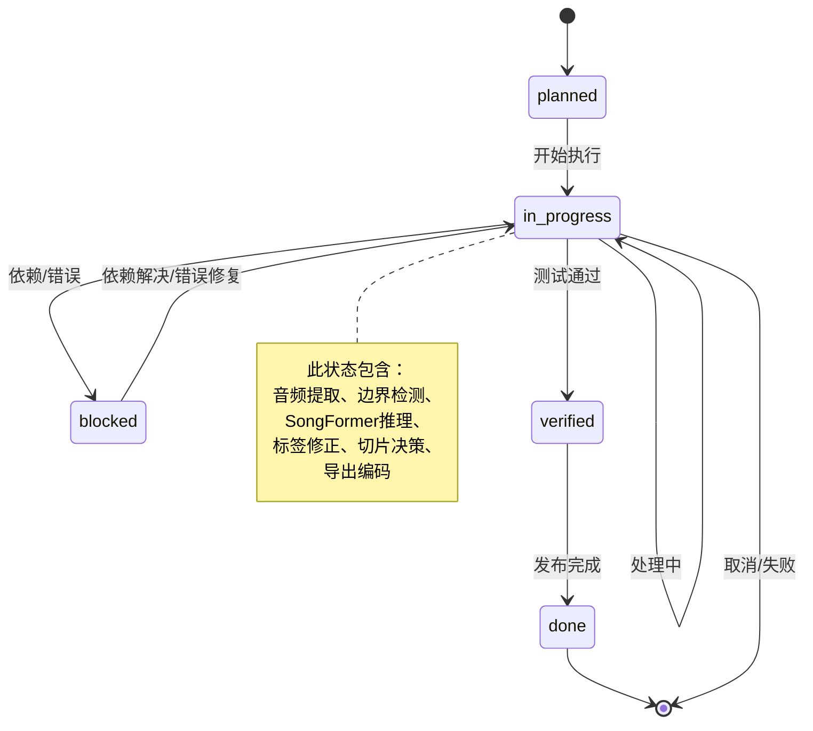

# PIPELINE_SPEC（流程与状态机规范）

**文档版本**: v1.0
**创建时间**: 2026-04-15
**最后更新**: 2026-04-18
**责任人**: AI
**变更日志**:
- 2026-04-15: 初始创建
- 2026-04-18: 添加统一文档头，链接GLOSSARY.md

---

## 0. 术语与定义

所有术语定义请参考：[GLOSSARY.md](../GLOSSARY.md)

---

## 1. 目标
- 固化切片与字幕主流程，明确每个阶段输入、输出、状态与失败处理。

## 2. 适用范围
- 切片页主流程（优先）
- 字幕页流程（不回退保障）

## 3. 输入与输出
- 输入：视频源、配置参数、识曲配置、导出配置。
- 输出：切片文件、日志、`run_summary.json`。

---

## 4. 切片流程（主链路）
1. 输入校验（路径、格式、时长参数）
2. 音频提取
3. 歌曲边界检测（OCR/音频/结构融合）
4. 歌曲内段落分析（SongFormer 主路径 + 规则修正）
5. 分类映射与时长约束（8-20 秒）
6. 导出编码（1080p + h264+aac + 60fps）
7. 产物汇总（metadata + run_summary）

---

## 5. 字幕流程（守住可用，不回退）
1. 输入校验
2. 音频抽取与 ASR
3. ASS 生成
4. 字幕烧录
5. 产物校验

---

## 6. 统一状态机
- `planned`：方案已定义，未执行
- `in_progress`：正在执行
- `blocked`：依赖或错误阻断
- `verified`：测试通过，待发布
- `done`：发布完成并归档

---

## 7. 失败分类与处理
- 输入类失败：参数非法、文件不可读 -> 立即阻断并提示
- 依赖类失败：模型/库缺失 -> 标注为 blocked，输出修复建议
- 运行类失败：识别或导出失败 -> 记录 error_code + fallback
- 结果类失败：达不到验收阈值 -> 标注 verified=false

## 8. 验收标准
- 切片流程与字幕流程均有清晰的输入、输出、状态定义。
- 任一失败都可归类并给出下一步动作。
